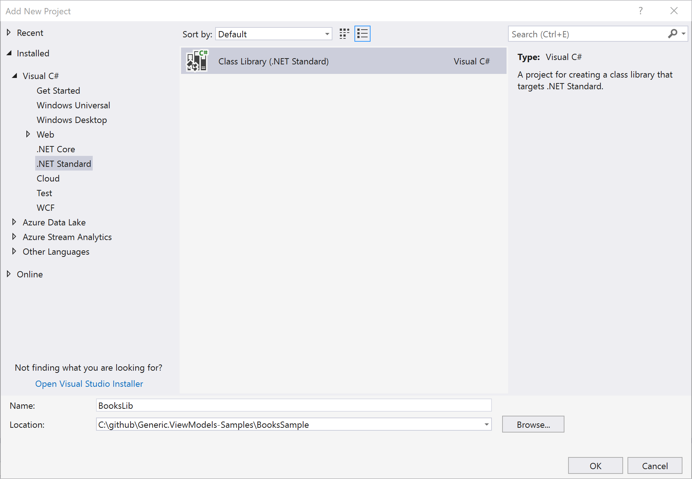
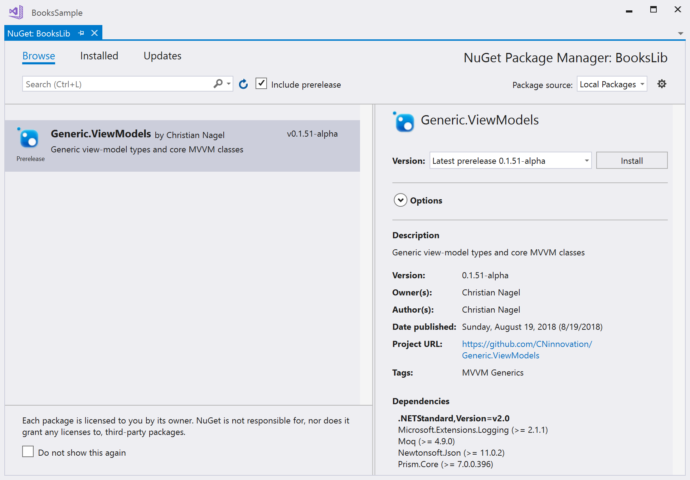

# Preparations to use Generic.ViewModels with a Windows App

## Create a .NET Standard Library

1. Create a .NET Standard Library named BooksLib with models, services, and view-models



2. Add the NuGet package to the the Generic.ViewModels Library



> Generic.ViewModels is currently not available on the NuGet server. This will change as the library proceeds. Now, you can either clone the repository with the following command, and a) include the project in your solution and add a project reference, or b) create a NuGet package and configure the NuGet package manager to use your local directory.

`git clone https://github.com/GenericViewModels/Generic.ViewModels` 

Create a NuGet package with the dotnet CLI:

`dotnet pack`

3. Create the directories `Models`, `Services`, and `ViewModels`.

4. Reference the Prism.Core Library

## Create a UWP Project named BooksApp-Windows

Add NuGet packages and references:

    * Reference the BooksLib Library
    * Add the NuGet package *Microsoft.Extensions.DependencyInjection*
    * Add the NuGet package *Microsoft.Extensions.Logging* and *Microsoft.Extensions.Logging.Debug*
    * Add the NuGet package *Microsoft.UI.Xaml*

The package *Microsoft.UI.Xaml* contains XAML controls for Windows apps that can be used with older Windows 10 versions. These controls need some styles included in the application. Add the `XamlControlResources` element to the file `App.xaml`:

```xml
<Application
    x:Class="BooksApp_Windows.App"
    xmlns="http://schemas.microsoft.com/winfx/2006/xaml/presentation"
    xmlns:x="http://schemas.microsoft.com/winfx/2006/xaml"
    xmlns:local="using:BooksApp_Windows">
    <Application.Resources>
        <XamlControlsResources xmlns="using:Microsoft.UI.Xaml.Controls"/>
    </Application.Resources>

</Application>
```

Now you're ready to [implement the Books library](02_BooksLib.md).