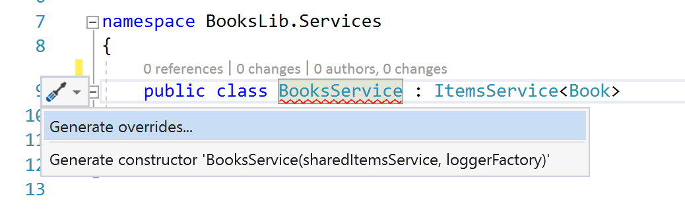

# Implement the BooksLib Library

This library can be used from the UWP, WPF, and Xamarin apps.

Before creating this library, [prepare the projects](01_Preparation.md).

## Create a Model

Create the `Book` class in the library BooksLib

```csharp
    public class Book : BindableBase
    {
        public int BookId { get; set; }

        private string _title;
        public string Title
        {
            get => _title;
            set => SetProperty(ref _title, value);
        }

        private string _publisher;
        public string Publisher
        {
            get => _publisher;
            set => SetProperty(ref _publisher, value);
        }

        public override string ToString() => Title;
    }
```

## Create a Sample Repository

Create a repository interface:

```csharp
    public interface IRepository<T, in TKey>
    {
        Task<T> GetItemAsync(TKey id);
        Task<IEnumerable<T>> GetItemsAsync();
        Task<T> AddAsync(T item);
        Task<T> UpdateAsync(T item);
        Task<bool> DeleteAsync(TKey id);
    }
 ```

Create a sample repository implementing the interface `IRepository` to add, update, delete, and return `Book` objects

 ```csharp
     public class BooksSampleRepository : IRepository<Book, int>
    {
        private List<Book> _books;
        public BooksSampleRepository()
        {
            InitSampleBooks();
        }

        private void InitSampleBooks()
        {
            _books = new List<Book>()
            {
                new Book { BookId = 1, Title = "Professional C# 7 and .NET Core 2", Publisher = "Wrox Press" },
                new Book { BookId = 2, Title = "Professional C# 6 and .NET Core 1.0", Publisher = "Wrox Press" },
                new Book { BookId = 3, Title = "Professional C# 5.0 and .NET 4.5.1", Publisher = "Wrox Press" },
                new Book { BookId = 4, Title = "Enterprise Services with the .NET Framework", Publisher = "AWL" }
            };
        }

        public Task<bool> DeleteAsync(int id)
        {
            Book bookToDelete = _books.Find(b => b.BookId == id);
            if (bookToDelete != null)
            {
                return Task.FromResult(_books.Remove(bookToDelete));
            }
            return Task.FromResult(false);
        }

        public Task<Book> GetItemAsync(int id) =>
            Task.FromResult(_books.Find(b => b.BookId == id));

        public Task<IEnumerable<Book>> GetItemsAsync() =>
            Task.FromResult<IEnumerable<Book>>(_books);

        public Task<Book> UpdateAsync(Book item)
        {
            Book bookToUpdate = _books.Find(b => b.BookId == item.BookId);
            int ix = _books.IndexOf(bookToUpdate);
            _books[ix] = item;
            return Task.FromResult(_books[ix]);
        }

        public Task<Book> AddAsync(Book item)
        {
            item.BookId = _books.Select(b => b.BookId).Max() + 1;
            _books.Add(item);
            return Task.FromResult(item);
        }
    }
 ```

 > The sample repository uses in-memory data. The method signatures are defined with async methods to easily create repositories using async features, e.g. using the `HttpClient` to access API services.

## Create a Interface and a Service Implementation

Create a `BooksService` class that derives from the generic base class `ItemsService<T>` using the `Book` class for the generic type parameter

```csharp
    public class BooksService : ItemsService<Book>
    {
    }
```

Use **Quick Actions** in Visual Studio to create the constructor.



Add the injection of the `IRepository<Book, int>` interface to the `BooksService` class.

```csharp
    public class BooksService : ItemsService<Book>
    {
        private readonly IRepository<Book, int> _booksRepository;

        public BooksService(
            IRepository<Book, int> booksRepository,
            ISharedItems<Book> sharedItemsService, 
            ILoggerFactory loggerFactory) 
            : base(sharedItemsService, loggerFactory)
        {
            _booksRepository = booksRepository ?? throw new ArgumentNullException(nameof(booksRepository));
        }
```

Implement overrides of the methods `RefreshAsync`, `AddOrUpdateAsync`, and `DeleteAsync`.

```csharp
        public override async Task RefreshAsync()
        {
            IEnumerable<Book> books = await _booksRepository.GetItemsAsync();
            Items.Clear();

            foreach (var book in books)
            {
                Items.Add(book);
            }

            SetSelectedItem(Items.FirstOrDefault());
            await base.RefreshAsync();
        }

        public override async Task<Book> AddOrUpdateAsync(Book item)
        {
            Book updated = null;
            if (item.BookId <= 0)
            {
                updated = await _booksRepository.AddAsync(item);
            }
            else
            {
                updated = await _booksRepository.UpdateAsync(item);
            }
            ReplaceItemInItems(updated);
            SetSelectedItem(updated);
            return updated;
        }

        private void ReplaceItemInItems(Book item)
        {
            var oldItem = Items.SingleOrDefault(b => b.BookId == item.BookId);
            if (oldItem != null)
            {
                int index = Items.IndexOf(oldItem);
                Items.RemoveAt(index);
                Items.Insert(index, item);
            }
            else
            {
                Items.Add(item);
            }
        }

        public override async Task DeleteAsync(Book item)
        {
            await _booksRepository.DeleteAsync(item.BookId);
            Items.Remove(item);
            SetSelectedItem(Items.FirstOrDefault());
        }
```

## Create a view-model for an item shown within a list

Create the class `BookItemViewModel` that derives from the base class `ItemViewModel<Book>`. This view-model defines the command DeleteBookCommand what allows to delete a book when it is shown in the list. You can add other commands similar.

```csharp
    public class BookItemViewModel : ItemViewModel<Book>
    {
        public BookItemViewModel(
            Book item,
            IShowProgressInfo showProgressInfo)
            : base(item, showProgressInfo)
        {
        }
    }
```

> The source code contains a command to delete items, and for the command additional services are needed for the implementation of the command handler. This functionality will be implemented in a later stage.

## Create a View-Model to display a list of books

Create the class `BooksViewModel`. This class derives from the base class `MasterDetailViewModel

```csharp
    public class BooksViewModel : MasterDetailViewModel<BookItemViewModel, Book>
    {
        public BooksViewModel(
            IItemsService<Book> itemsService, 
            IItemToViewModelMap<Book, BookItemViewModel> viewModelMap, 
            IShowProgressInfo showProgressInfo, ILoggerFactory loggerFactory) 
            : base(itemsService, viewModelMap, showProgressInfo, loggerFactory)
        {
        }
    }
```

## Create a Mapping class to map the Book to the BookItemViewModel

The class `BookToBookItemViewModelMap` needs to implement the interface `IItemToViewModelMap<Book, BookItemViewModel>`. Most of the implementation can be used form the base class `ItemToViewModelMap<Book, BookItemViewModel>` which only needs an implementation of the abstract method `CreateViewModel`.

```csharp
    public class BookToBookItemViewModelMap : ItemToViewModelMap<Book, BookItemViewModel>
    {
        private readonly IItemsService<Book> _itemsService;
        private readonly IShowProgressInfo _showProgressInfo;
        private readonly ILoggerFactory _loggerFactory;
        public BookToBookItemViewModelMap(
            IItemsService<Book> itemsService,
            IShowProgressInfo showProgressInfo,
            ILoggerFactory loggerFactory)
        {
            _itemsService = itemsService ?? throw new ArgumentNullException(nameof(itemsService));
            _showProgressInfo = showProgressInfo ?? throw new ArgumentNullException(nameof(showProgressInfo));
            _loggerFactory = loggerFactory ?? throw new ArgumentNullException(nameof(loggerFactory));
        }
        protected override BookItemViewModel CreateViewModel(Book item) =>
            new BookItemViewModel(item, _itemsService, _showProgressInfo, _loggerFactory);
    }
```

Now you're ready to [create the Windows app](03_UWPList.md).
